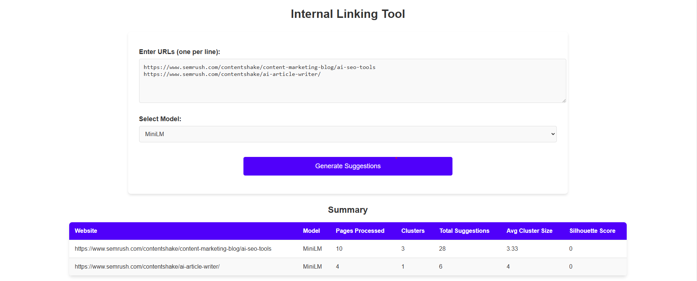
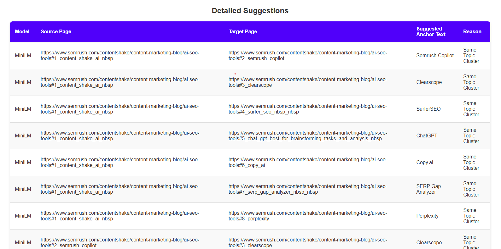

# AI-Powered Internal Linking Opportunity Finder

## 📌 Overview
This project is an AI-driven internal linking tool that analyzes website pages to find and suggest contextually relevant internal links. By improving internal linking, websites can boost SEO, enhance crawlability, and improve PageRank distribution.

## 🚀 Problem Statement
Websites often miss internal linking opportunities, leading to:
- Poor crawlability by search engines.
- Inefficient PageRank distribution.
- Missed ranking potential for related content.

## 🎯 Proposed Solution
Our AI-powered tool finds related pages, identifies missing internal links, and provides actionable recommendations for better interlinking. The tool uses:
1. **Website Crawling** – Extracts content, meta descriptions, headings, and existing links.
2. **AI-Powered Topic Clustering** – Uses NLP and embeddings to group pages into semantic topic clusters.
3. **Internal Link Suggestion Engine** – Detects hub and spoke pages, suggesting links based on relevance.
4. **Actionable Report Generation** – Provides a prioritized list of missing internal links with recommended anchor texts.






---
## 🛠️ Tech Stack
### **Frontend:**
- **ReactJS** – For the user interface.
- **CSS & JavaScript** – For styling and interactions.
- **Charts.js** – For data visualization of linking opportunities.

### **Backend:**
- **Python (FastAPI)** – To handle processing and API requests.
- **Playwright / Cheerio.js** – For web crawling and extracting page data.
- **PostgreSQL** – For storing structured data.
- **NetworkX / pgvector** – For graph-based clustering of related content.
- **OpenAI GPT / Hugging Face Embeddings** – For topic clustering and NLP tasks.

---
## 🧠 Algorithm Explanation
### **1. Website Crawling**
- Extracts **HTML content, meta descriptions, headings, and existing links** from a given URL.
- Uses **Playwright / Cheerio.js** to fetch and parse webpage content efficiently.

### **2. AI-Powered Topic Clustering**
- Generates embeddings for each page using **MiniLM / BERT / T5**.
- Uses **cosine similarity** to group semantically related pages.
- Identifies missing internal links by detecting **unlinked but relevant pages**.

### **3. Internal Link Suggestion Engine**
- Detects **hub pages** (high-authority pages) and **spoke pages** (supporting pages).
- Scores potential internal linking opportunities based on **relevance, page authority, and frequency of occurrence**.

### **4. Report Generation & Visualization**
- Generates a structured report listing:
  - Missing internal links.
  - Recommended anchor texts.
  - Priority pages that need better linking.
- Displays insights via **tables and charts**.
- Optionally, generates a **script to insert links automatically**.

---
## 📌 Example Output
### **Existing Content:**
✅ *AI Tools for Marketing* (Hub)

### **Missing Internal Link Opportunity:**
❌ No link to *AI Tools for SEO* (Spoke)

### **Suggested Fix:**
- Add a link from *AI Tools for Marketing* → *AI Tools for SEO* with the anchor text *"AI-driven SEO tools"*

---
## 🚀 How to Run This Project
### **1. Clone the Repository**
```bash
 git clone https://github.com/yourusername/ai-internal-linking.git
 cd ai-internal-linking
```

### **2. Set Up the Backend**
```bash
cd backend
python -m venv venv
source venv/bin/activate  # On Windows: venv\Scripts\activate
pip install -r requirements.txt
uvicorn main:app --reload
```

### **3. Set Up the Frontend**
```bash
cd frontend
npm install
npm start
```

### **4. Access the Application**
Open `http://localhost:3000` in your browser.

---
## 📌 Future Enhancements
- **Automated Link Insertion** – Modify website HTML dynamically.
- **Dashboard with Historical Insights** – Track improvements over time.
- **More Advanced NLP Models** – Improve clustering accuracy.

🚀 **Let's optimize your website’s internal linking with AI!**
